Animating a dragon curve fractal in Rust with minifb!

Co-authored by [Tom Wildenhain](https://github.com/tomwildenhain), who has also drawn dragon curve fractals [in PowerPoint](https://www.youtube.com/watch?v=O8l_awjgoMI&t=139).

Coded during Rust meetup at Hacker Dojo while eating pie.

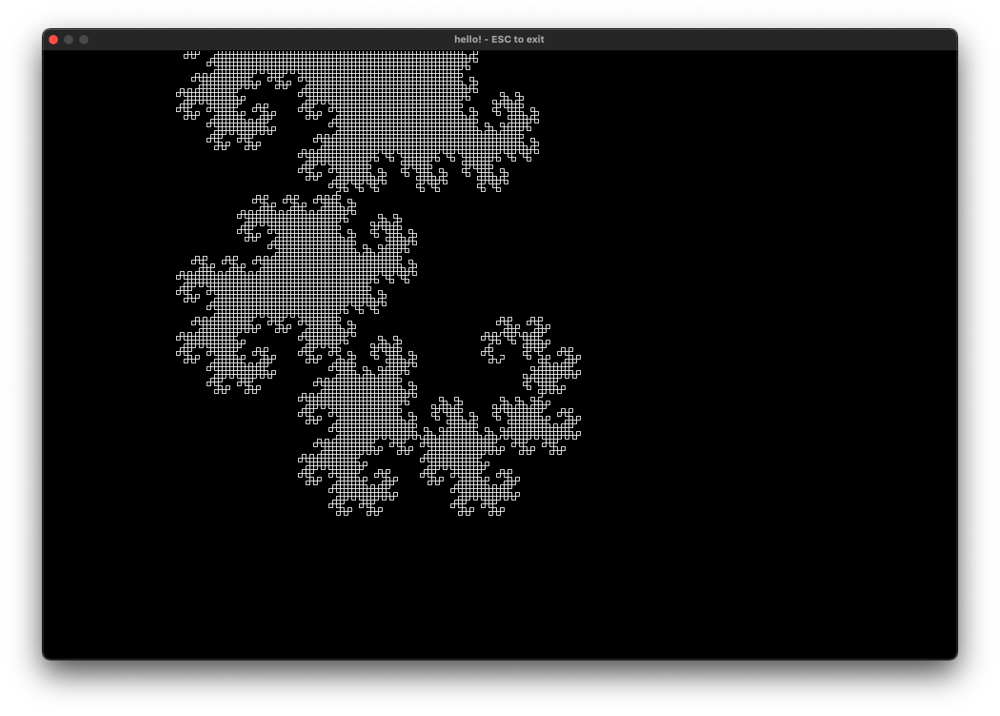

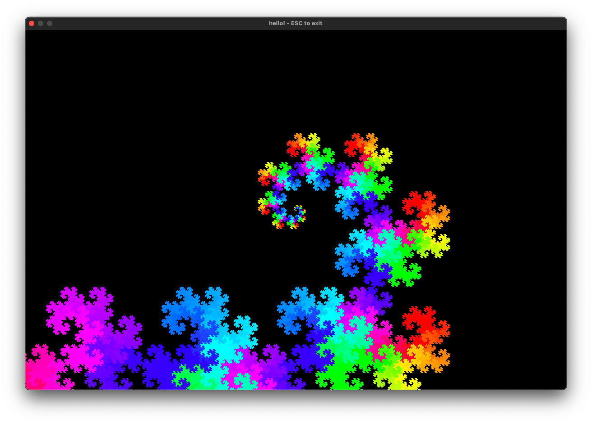

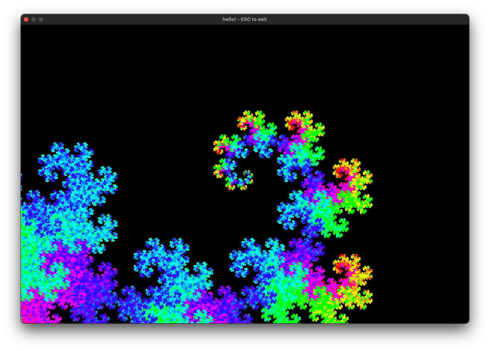

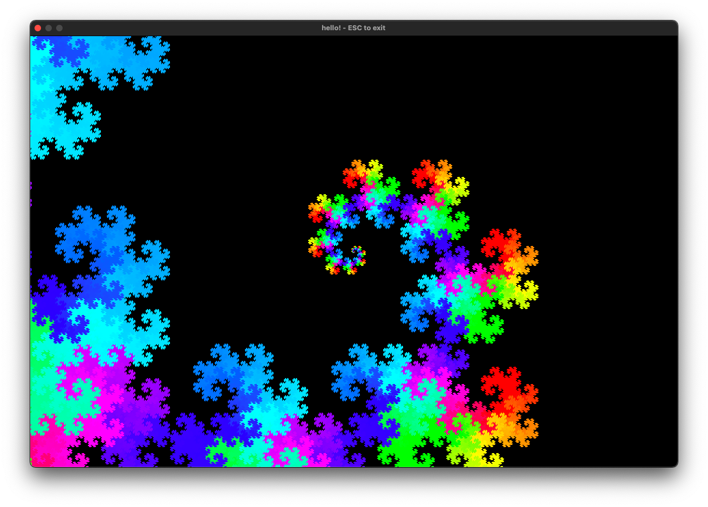

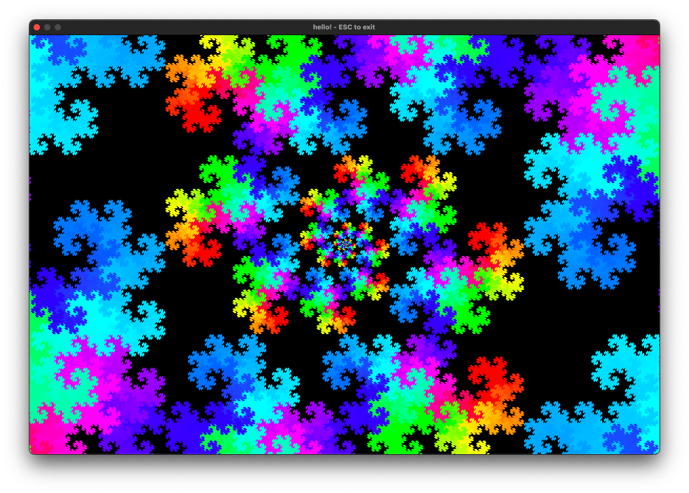

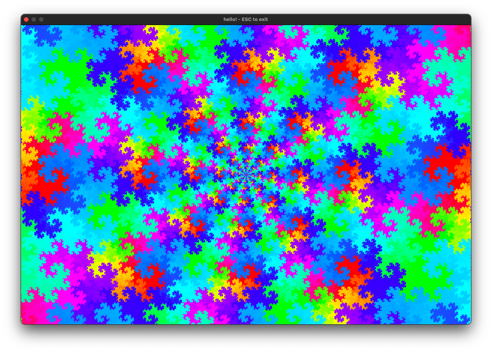

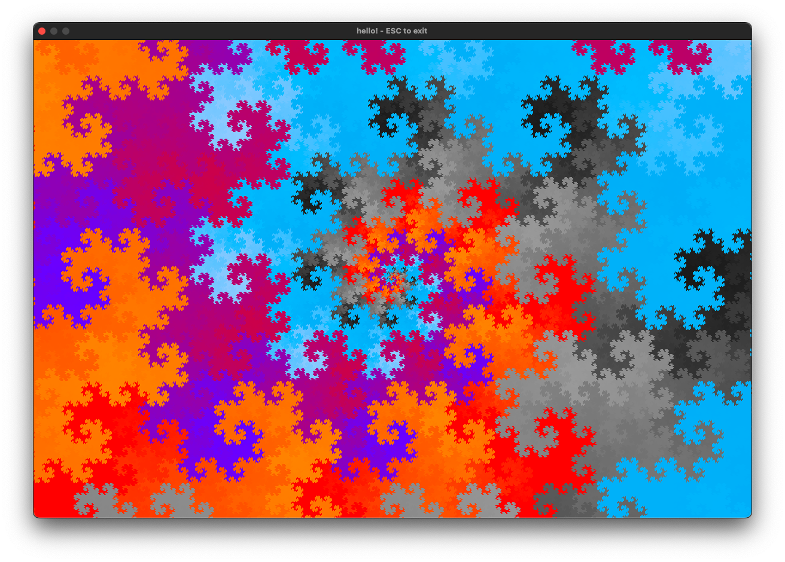

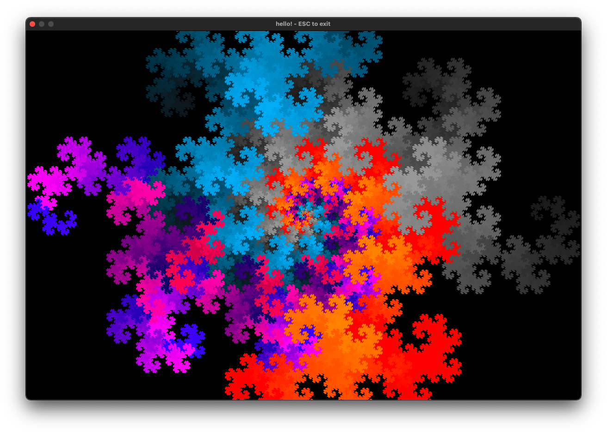

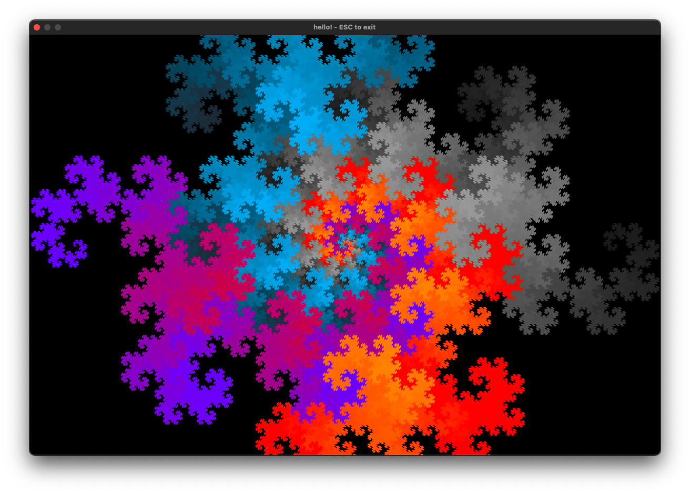

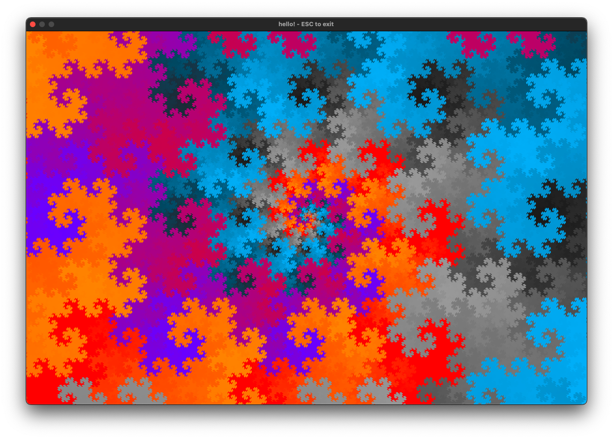

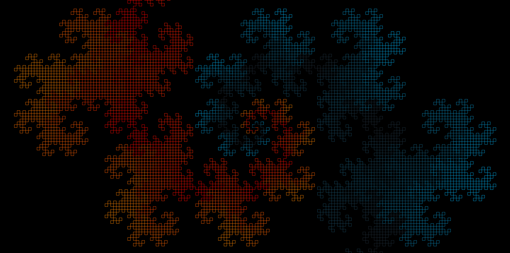
